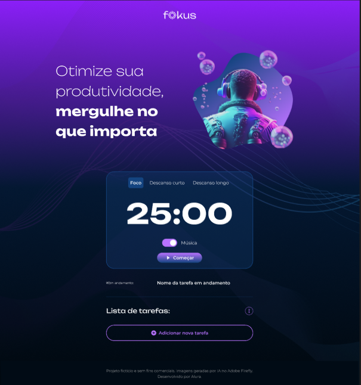

# 🧠 Fokus

**Fokus** é uma aplicação desenvolvida com o objetivo de aprimorar meus conhecimentos em **HTML**, **CSS**, **JavaScript**, além do uso de ferramentas do ecossistema Front-end como **Webpack** e **Babel**.  
📚 Este projeto é baseado em um curso da **Alura**, mas está sendo **desenvolvido de forma independente** por mim como forma de prática e reforço do aprendizado.

  

---

## 🚀 Funcionalidades

- ⏱ Temporizador Pomodoro com três modos: Foco, Descanso Curto e Descanso Longo
- ✅ Adição e gerenciamento de tarefas
- ▶️ Início de tarefa com nome personalizado
- ✅ Marcar tarefa como concluída
- 🗑 Remoção individual de tarefas
- 🧹 Remoção de todas as tarefas (pendentes ou concluídas)
- 🎵 Reprodução de música ambiente enquanto o timer está ativo
- 💻 Design responsivo para diferentes tamanhos de tela

---

## 📦 Tecnologias utilizadas

- **HTML5**
- **CSS3**
- **JavaScript (ES6+)**
- **Webpack** (Bundler)
- **Babel** (Compilador)

---

## ⚠️ Aviso

Este projeto foi desenvolvido com fins **educacionais**. As imagens utilizadas são geradas por IA (Adobe Firefly) e o código não é destinado para produção sem ajustes.

---

## 🧑‍💻 Desenvolvido por

[Yuri Cardoso Viana](https://github.com/Yuric-Viana) – Projeto feito com 💜 para estudo e prática Front-end.
